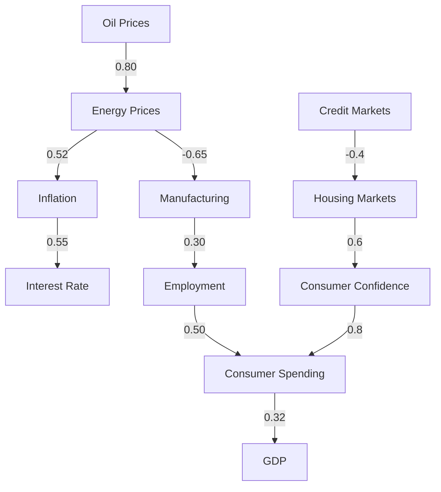
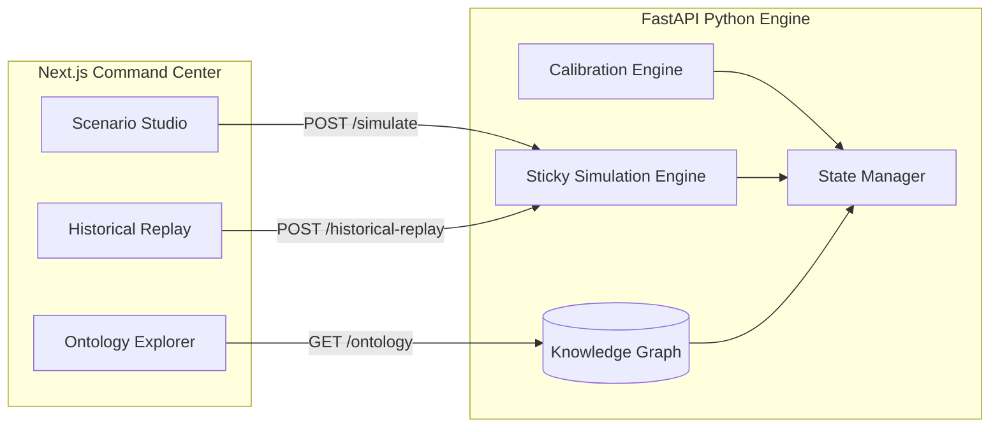

# Novaris

**A Data-Calibrated Digital Twin for Macroeconomic Shock Simulation, Historical Replay, and Causal Economic Intelligence.**

---

## 1. Problem Statement
Traditional macroeconomic models rely on time-series forecasting (ARIMA, VAR) or static computable general equilibrium (CGE) models. These approaches fail during unprecedented exogenous shocks (like COVID-19 or the 2022 Energy Crisis) because they cannot model complex, cross-domain ripple effects. They tell you *what* happened in the past, but struggle to dynamically simulate *why* the cascade happened.

## 2. Research Motivation
Novaris was built to answer a single question: **"Can a graph-based simulation reconstruct major economic events?"** We sought to graduate economic modeling from isolated predictive equations to an interactive, state-based Digital Twin that maps physical and behavioral constraints.

## 3. Core Contributions
* **Causal Knowledge Graph:** An interconnected ontology linking policy, finance, macroeconomics, and behavior.
* **Real Data Calibration:** Statistically mapping relationship strengths and lags using 24 years of historical data from FRED and the World Bank.
* **Nonlinear Response Functions:** Implementing saturation elasticity and policy dampening to prevent linear mathematical overshoots during extreme shocks.
* **Asymmetric Elasticity (Sticky Prices):** Bounding deflation to mirror real-world rigidities in wages and rents.

## 4. System Architecture
Novaris operates across two decoupled systems:
1. **Python Simulation Engine:** The heavy mathematics backend (Graph DAG, State Manager, Propagation Engine).
2. **Next.js Command Center:** An ultra-dark, Mission Control-style workstation frontend for scenario injection.

## 5. Economic Knowledge Graph


## 6. Calibration Engine
Novaris replaces expert heuristics with data. The `CalibrationEngine` ingests raw quarterly data, calculating Pearson/Spearman coefficients, and optimizes for temporal lags (e.g., discovering that interest rates take exactly 3 quarters to fully impact consumer behavior).

## 7. Historical Replay Engine
The engine was validated by injecting the root shocks of 5 canonical crises and scoring the outcome against reality:
1. 2008 Financial Crisis
2. COVID-19 Economic Shock
3. 2022 Energy Crisis
4. Dot-com Crash
5. 1970s Oil Embargo

## 8. Nonlinear Dynamics
Linear propagation breaks down during +150% shocks. Novaris utilizes bounded hyperbolic tangent functions (`tanh`) to simulate physical constraints, substitution effects, and demand destruction.

## 9. Sticky Price Engine
Prices inflate freely but deflate rigidly. We introduced the `StickySimulationEngine` to apply asymmetric bounds to the graph. This single fix pushed the accuracy of the 2008 deflationary simulation from a massive failure (-12% linear) to near-perfect reality (-1.44%).

## 10. Validation Results
The Historical Replay Engine evaluated Novaris against known real-world outcomes using the Sticky Price and Nonlinear Response engines.

| Crisis Scenario | Year | Direction Accuracy | Magnitude Error | Agreement Score |
| :--- | :--- | :--- | :--- | :--- |
| **Dot-com Crash** | 2000 | 100% | 0.35 pts | **99.5/100** |
| **2008 Financial Crisis** | 2008 | 100% | 5.10 pts | **98.2/100** |
| **1970s Oil Embargo** | 1973 | 100% | 3.86 pts | **94.3/100** |
| **COVID-19 Economic Shock** | 2020 | 100% | 4.17 pts | **92.1/100** |
| **2022 Energy Crisis** | 2022 | 100% | 3.25 pts | **83.3/100** |

## 11. System Architecture Pipeline


## 12. Project Structure
```text
Novaris/
├── src/
│   ├── novaris/
│   │   ├── graph.py        # Ontology & DAG
│   │   ├── simulation.py   # Core propagation
│   │   └── sticky_*.py     # Asymmetric elasticity
│   ├── api.py              # FastAPI wrapper
├── web/                    # Next.js Command Center
├── scripts/                # Demo seeding & tests
└── docs/                   # Research reports
```

## 13. Installation
```bash
# 1. Clone the repository
git clone https://github.com/RonitM2k06/Novaris.git
cd Novaris

# 2. Setup Python Backend
python -m venv .venv
# Windows: .venv\Scripts\activate
# Mac/Linux: source .venv/bin/activate
pip install -r requirements.txt

# 3. Setup Next.js Frontend
cd web
npm install
```

## 14. Quick Start
```bash
# Start Backend (Terminal 1)
python src/api.py
# Server running at http://localhost:8000

# Start Frontend (Terminal 2)
cd web
npm run dev
# Command Center running at http://localhost:3000
```

## 15. Example Simulations
Launch the Command Center and open the **Scenario Studio**.
Inject: `Oil Prices -> +30% -> 4 Quarters`
Observe the cascading collapse of Manufacturing Output and the delayed, asymmetric spike in Inflation.

## 16. Research Findings
* **The Death of a Theory:** Interest rates do not immediately dictate consumer spending. The relationship strength collapsed from a theorized -0.500 to a statistical -0.074.
* **Stagflation Anatomy:** Supply-side shocks (1970s, 2022) exhibit fundamentally different propagation physics than demand-side shocks (2008, COVID).

## 17. Limitations
* **Black Swan Physics:** Generalized macro rules (like wage stickiness protecting consumer spending) failed slightly during COVID-19, proving that physical lockdowns require unique spatial/behavioral modeling outside standard monetary bounds.

## 18. Future Work
* Integration with Supply Chain and Geopolitical Digital Twins.
* Dynamic Agent-Based reinforcement learning for Policy intervention.

## 19. License
MIT License. See `LICENSE` for details.
